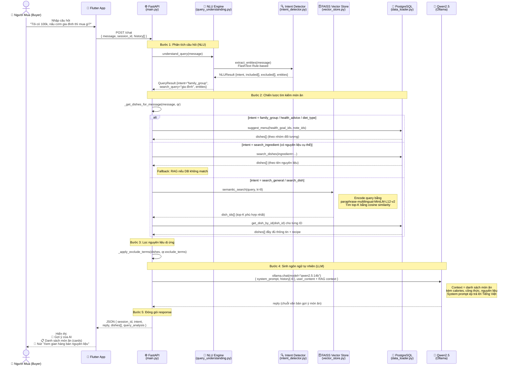
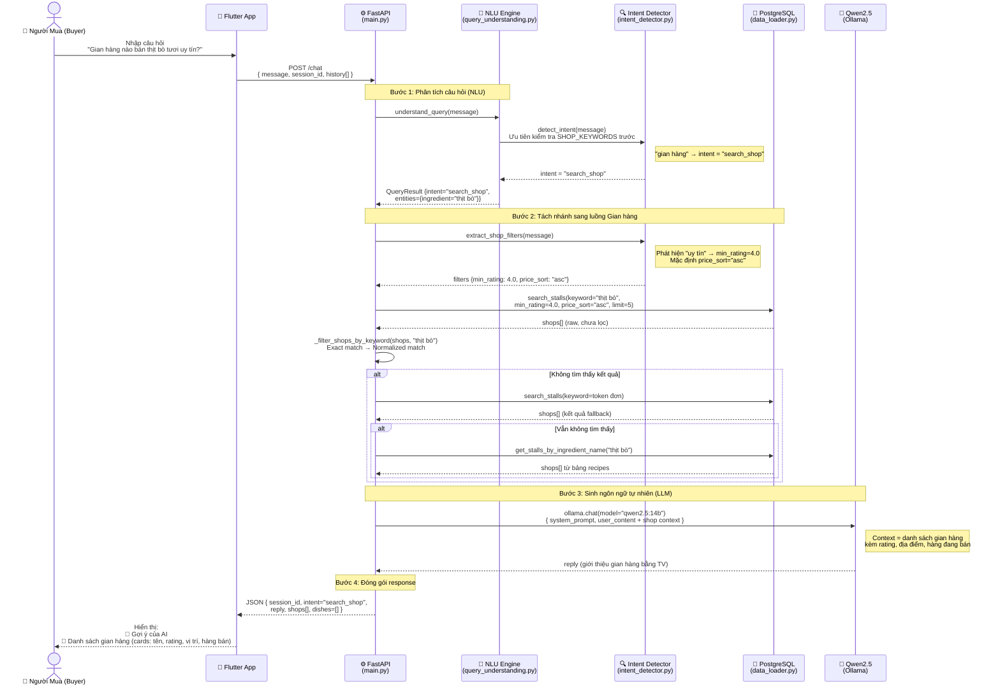
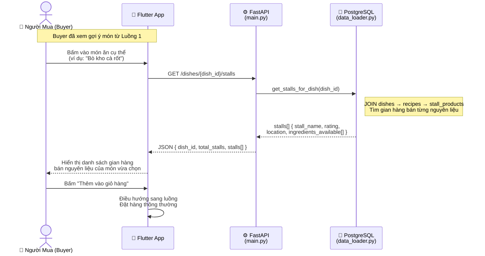
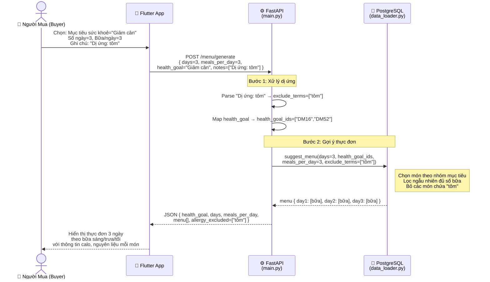

# Sơ đồ Tuần tự – Luồng AI Chat (DNGo)

Hệ thống AI bao gồm **2 luồng xử lý tách biệt**, được phân nhánh tự động dựa trên Intent phát hiện được từ câu hỏi của Buyer.

---

## Luồng 1: Chat AI Gợi Ý Món Ăn & Thực Đơn

---

## Luồng 2: Chat AI Tìm Gian Hàng

---

## Luồng 3: Buyer Chọn Món → Xem Gian Hàng Bán Nguyên Liệu

---

## Luồng 4: Tạo Thực Đơn Theo Mục Tiêu Sức Khoẻ (/menu/generate)

