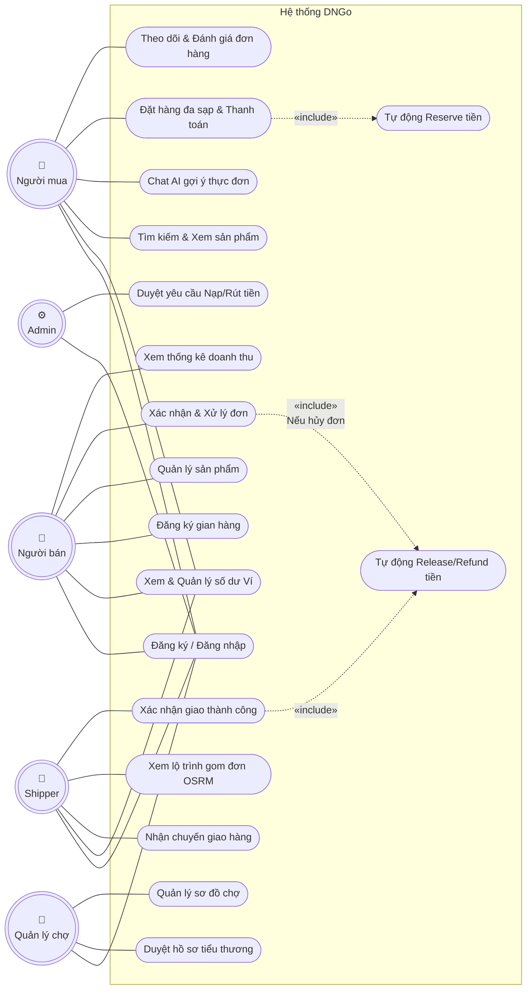
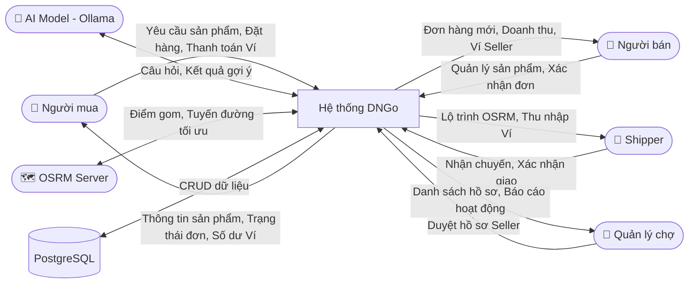
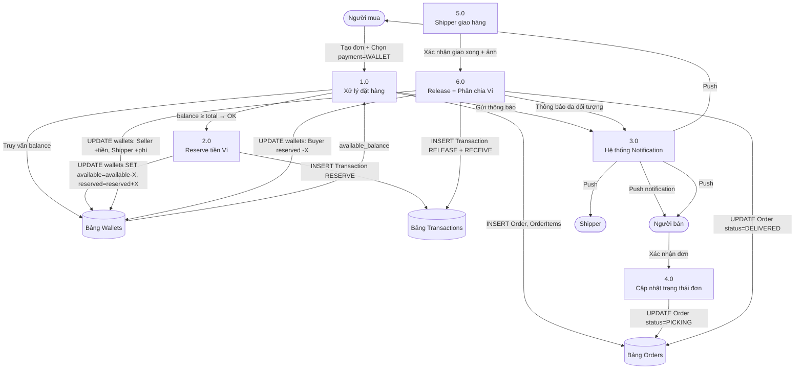
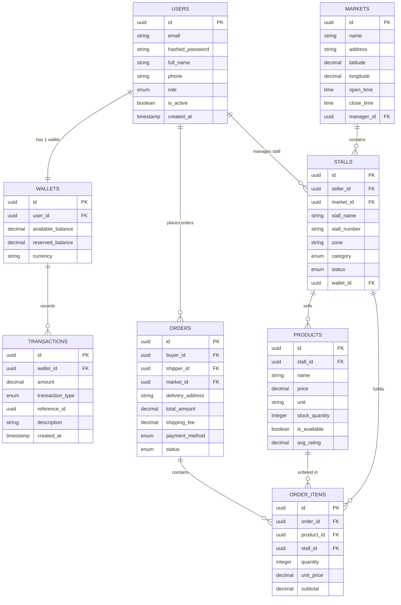

# CHƯƠNG 3: PHÂN TÍCH VÀ THIẾT KẾ HỆ THỐNG

---

## MỤC LỤC CHƯƠNG 3

- [3.1 Yêu cầu chức năng (Functional Requirements)](#31-yêu-cầu-chức-năng-functional-requirements)
- [3.2 Yêu cầu phi chức năng (Non-Functional Requirements)](#32-yêu-cầu-phi-chức-năng-non-functional-requirements)
- [3.3 Sơ đồ Use Case tổng quát](#33-sơ-đồ-use-case-tổng-quát)
- [3.4 Đặc tả Use Case chi tiết](#34-đặc-tả-use-case-chi-tiết)
- [3.5 Sơ đồ Luồng dữ liệu (DFD)](#35-sơ-đồ-luồng-dữ-liệu-dfd)
- [3.6 Thiết kế Cơ sở dữ liệu (ERD)](#36-thiết-kế-cơ-sở-dữ-liệu-erd)
- [3.7 Thiết kế kiến trúc hệ thống](#37-thiết-kế-kiến-trúc-hệ-thống)

---

## 3.1 Yêu cầu chức năng (Functional Requirements)

Yêu cầu chức năng được phân loại theo từng vai trò người dùng trong hệ thống.

### 3.1.1 Yêu cầu chức năng của Người Mua (Buyer)

**Bảng 3.1.1: Yêu cầu chức năng của Người Mua**

| Mã YC | Tên chức năng | Mô tả chi tiết | Độ ưu tiên |
|-------|-------------|----------------|-----------|
| BR-01 | Đăng ký tài khoản | Người mua nhập email, mật khẩu, họ tên, số điện thoại và địa chỉ giao hàng mặc định để tạo tài khoản mới. Hệ thống tự động tạo Ví điện tử cá nhân với số dư ban đầu = 0 cho người dùng mới. | Cao |
| BR-02 | Đăng nhập | Xác thực người dùng bằng email và mật khẩu. Hệ thống trả về JWT Token với thời hạn 24 giờ. | Cao |
| BR-03 | Cập nhật hồ sơ cá nhân | Người mua có thể chỉnh sửa tên, số điện thoại, địa chỉ giao hàng và ảnh đại diện. Thông tin được cập nhật trực tiếp lên Database qua API `PATCH /users/me`. | Trung bình |
| BR-04 | Xem danh sách sản phẩm | Hiển thị tất cả sản phẩm đang bán từ các gian hàng trong một chợ, phân nhóm theo danh mục: Rau củ, Thịt cá, Hải sản, Trái cây, Gia vị, Khác. | Cao |
| BR-05 | Tìm kiếm sản phẩm | Người mua nhập từ khóa vào thanh tìm kiếm. Hệ thống tìm kiếm theo tên sản phẩm và tên gian hàng. Hỗ trợ lọc theo khoảng giá và danh mục. | Cao |
| BR-06 | Xem chi tiết sản phẩm | Hiển thị thông tin: tên, ảnh, giá, đơn vị tính, mô tả, tên gian hàng, đánh giá sao, số lượng tồn kho. | Cao |
| BR-07 | Chat AI gợi ý thực đơn | Người mua gửi tin nhắn tự nhiên như "Tôi có 100k, mua nguyên liệu gì để nấu cơm gia đình?" → AI phân tích ngữ nghĩa, tra cứu Vector DB, trả về gợi ý món ăn và danh sách nguyên liệu cần mua kèm giá ước tính. | Cao |
| BR-08 | Thêm sản phẩm vào giỏ hàng | Người mua chọn sản phẩm, chọn số lượng và bấm "Thêm vào giỏ". Giỏ hàng hỗ trợ sản phẩm từ nhiều sạp khác nhau cùng lúc (Multi-stall Cart). | Cao |
| BR-09 | Xem và chỉnh sửa giỏ hàng | Hiển thị danh sách sản phẩm trong giỏ, nhóm theo từng Gian hàng. Cho phép tăng/giảm số lượng, xóa từng sản phẩm, xóa toàn bộ giỏ hàng. | Cao |
| BR-10 | Đặt hàng | Người mua chọn địa chỉ giao hàng, ghi chú, chọn phương thức thanh toán (Ví DNGo hoặc COD) rồi xác nhận đặt hàng. Hệ thống kiểm tra: số dư ví đủ (nếu thanh toán ví), giờ đặt hàng hợp lệ (trước 19:00), tồn kho đủ. | Cao |
| BR-11 | Thanh toán qua Ví DNGo | Khi xác nhận đặt hàng bằng Ví, hệ thống kiểm tra số dư, trừ tiền vào trạng thái "tạm giữ" (Reserved). Tiền chỉ thực sự chuyển cho Seller sau khi Shipper giao hàng thành công. | Cao |
| BR-12 | Theo dõi trạng thái đơn hàng | Màn hình "Đơn hàng của tôi" hiển thị danh sách đơn hàng và trạng thái hiện tại: Chờ xác nhận → Đang chuẩn bị → Shipper đang lấy hàng → Đang giao → Đã giao → Hoàn thành. | Cao |
| BR-13 | Xem lịch sử đơn hàng | Người mua xem lại tất cả đơn hàng đã hoàn thành, bao gồm thông tin sản phẩm, tổng tiền, ngày đặt, ngày nhận. | Trung bình |
| BR-14 | Đánh giá sản phẩm | Sau khi đơn hàng hoàn thành, người mua có thể đánh giá sao (1–5) và viết nhận xét từng sản phẩm. Đánh giá hiển thị trên trang sản phẩm của Seller. | Trung bình |
| BR-15 | Xem Ví điện tử | Màn hình Ví hiển thị số dư hiện tại, số tiền đang tạm giữ, lịch sử nạp tiền và giao dịch mua hàng. | Cao |
| BR-16 | Nạp tiền vào Ví | Người mua xem thông tin tài khoản ngân hàng của DNGo, chuyển khoản, nhập mã yêu cầu nạp. Admin xác nhận và hệ thống tự động cộng tiền vào Ví. | Cao |
| BR-17 | Nhận thông báo | Nhận push notification khi trạng thái đơn hàng thay đổi, khi tiền ví được cộng/trừ. | Trung bình |
| BR-18 | Đăng xuất | Xóa JWT token khỏi Secure Storage trên thiết bị, chuyển về màn hình đăng nhập. | Cao |

### 3.1.2 Yêu cầu chức năng của Người Bán – Tiểu thương (Seller)

**Bảng 3.1.2: Yêu cầu chức năng của Người Bán**

| Mã YC | Tên chức năng | Mô tả chi tiết | Độ ưu tiên |
|-------|-------------|----------------|-----------|
| SE-01 | Đăng ký tài khoản Seller | Nhập thông tin cá nhân và thông tin gian hàng (tên sạp, danh mục hàng, số sạp, khu vực trong chợ). Hồ sơ được gửi lên hệ thống và chờ Quản lý chợ duyệt. | Cao |
| SE-02 | Đăng nhập | Xác thực bằng email và mật khẩu, nhận JWT phân quyền Seller. | Cao |
| SE-03 | Quản lý thông tin gian hàng | Seller xem và cập nhật thông tin gian hàng: Tên sạp, mô tả, ảnh bìa, giờ hoạt động, danh mục chuyên bán. | Trung bình |
| SE-04 | Thêm sản phẩm mới | Seller nhập tên, mô tả, giá, đơn vị tính, số lượng tồn kho, upload ảnh. Sản phẩm được lưu vào DB và hiển thị ngay trên App Người mua. | Cao |
| SE-05 | Chỉnh sửa/Xóa sản phẩm | Seller có thể sửa thông tin, đổi giá, cập nhật tồn kho. Khi xóa sản phẩm, hệ thống ẩn sản phẩm (soft delete) không xóa hẳn để giữ lịch sử đơn cũ. | Cao |
| SE-06 | Nhận thông báo đơn mới | Khi có khách đặt hàng sản phẩm của mình, Seller nhận push notification ngay lập tức. Âm thanh thông báo riêng biệt cho đơn hàng mới. | Cao |
| SE-07 | Xem danh sách đơn hàng | Màn hình liệt kê tất cả đơn hàng theo trạng thái: "Chờ xác nhận", "Đang chuẩn bị", "Shipper đã lấy", "Hoàn thành", "Đã hủy". | Cao |
| SE-08 | Xác nhận / Từ chối đơn hàng | Seller xem chi tiết đơn (sản phẩm, số lượng, ghi chú của khách) và bấm "Xác nhận chuẩn bị" hoặc "Từ chối" (kèm lý do). Nếu từ chối, tiền ví Buyer được hoàn lại tức thì. | Cao |
| SE-09 | Xem thống kê doanh thu | Biểu đồ hiển thị doanh thu theo ngày/tuần/tháng. Số liệu: tổng đơn, tổng tiền thu, tổng sản phẩm đã bán, sản phẩm bán chạy nhất. | Trung bình |
| SE-10 | Xem Ví tiểu thương | Hiển thị số dư hiện tại trong Ví Seller, lịch sử nhận tiền từ các đơn hoàn tất, lịch sử yêu cầu rút tiền. | Cao |
| SE-11 | Yêu cầu rút tiền | Seller nhập số tiền muốn rút và số tài khoản ngân hàng. Yêu cầu gửi đến Admin để xử lý chuyển khoản. Trạng thái hiển thị: "Đang xử lý" → "Đã chuyển". | Cao |
| SE-12 | Chat với Buyer | Seller và Buyer có thể nhắn tin trực tiếp trong App để hỏi thêm về sản phẩm hoặc đơn hàng. | Thấp |

### 3.1.3 Yêu cầu chức năng của Shipper

**Bảng 3.1.3: Yêu cầu chức năng của Shipper**

| Mã YC | Tên chức năng | Mô tả chi tiết | Độ ưu tiên |
|-------|-------------|----------------|-----------|
| SH-01 | Đăng ký tài khoản Shipper | Nhập thông tin cá nhân, CMND/CCCD, và số Ví Shipper sẽ nhận thu nhập. Hồ sơ chờ Admin phê duyệt. | Cao |
| SH-02 | Đăng nhập | Xác thực bằng email và mật khẩu, nhận JWT phân quyền Shipper. | Cao |
| SH-03 | Xem danh sách đơn hàng chờ giao | Màn hình Home Shipper hiển thị danh sách đơn hàng trong khu vực chợ đang cần shipper nhận. | Cao |
| SH-04 | Nhận chuyến giao hàng | Shipper bấm "Nhận chuyến" để nhận trách nhiệm giao một hoặc nhiều đơn hàng trong cùng khu vực. | Cao |
| SH-05 | Xem lộ trình gom hàng | Sau khi nhận chuyến, App hiển thị bản đồ (OpenStreetMap) với các Pickup Points (vị trí các sạp cần lấy hàng) và Delivery Point (địa chỉ khách). Lộ trình được tối ưu bởi OSRM. | Cao |
| SH-06 | Xác nhận lấy hàng tại từng sạp | Khi đến sạp, Shipper bấm "Đã lấy xong tại [Tên Sạp]". Hệ thống cập nhật trạng thái cho Seller và Buyer. | Cao |
| SH-07 | Xác nhận giao hàng thành công | Shipper bấm "Xác nhận giao thành công" và upload ảnh bằng chứng. Hệ thống tự động: (1) Cập nhật trạng thái đơn thành "Đã giao"; (2) Chuyển tiền từ trạng thái "Tạm giữ" → Ví Seller tương ứng; (3) Cộng phí vận chuyển vào Ví Shipper. | Cao |
| SH-08 | Báo cáo giao hàng thất bại | Shipper ghi nhận lý do không giao được (không có người nhận, sai địa chỉ...). Hệ thống chuyển đơn sang trạng thái "Cần xử lý". | Trung bình |
| SH-09 | Xem thu nhập | Màn hình hiển thị thu nhập theo ngày, danh sách chuyến đã giao và phí vận chuyển tương ứng từng chuyến. | Cao |
| SH-10 | Xem bản đồ chợ | Hiển thị sơ đồ mặt bằng chợ với vị trí các sạp, giúp Shipper mới nhanh chóng định hướng khi lấy hàng. | Trung bình |

### 3.1.4 Yêu cầu chức năng của Quản lý chợ (Market Manager)

**Bảng 3.1.4: Yêu cầu chức năng của Quản lý chợ**

| Mã YC | Tên chức năng | Mô tả chi tiết | Độ ưu tiên |
|-------|-------------|----------------|-----------|
| MM-01 | Đăng nhập | Xác thực bằng email và mật khẩu, nhận JWT phân quyền MarketManager. | Cao |
| MM-02 | Xem danh sách tiểu thương chờ duyệt | Hiển thị danh sách Seller đã đăng ký nhưng chưa được duyệt. Thông tin bao gồm: tên Seller, số sạp đăng ký, loại hàng hóa, ngày đăng ký. | Cao |
| MM-03 | Duyệt hồ sơ tiểu thương | Quản lý xem chi tiết hồ sơ và bấm "Phê duyệt". Hệ thống: (1) Tạo Stall record liên kết với Seller; (2) Tạo Wallet cho Seller; (3) Gửi thông báo cho Seller. | Cao |
| MM-04 | Từ chối hồ sơ tiểu thương | Quản lý nhập lý do từ chối và gửi về cho Seller để bổ sung thêm thông tin. | Cao |
| MM-05 | Xem danh sách gian hàng đang hoạt động | Màn hình liệt kê tất cả Stall đã được duyệt, đang bán hàng. Thông tin: tên, khu vực, danh mục, số sản phẩm, doanh thu tháng hiện tại. | Trung bình |
| MM-06 | Xem sơ đồ chợ | Hiển thị bố trí mặt bằng các gian hàng theo khu vực (Khu A – Rau củ, Khu B – Thịt cá...). | Trung bình |
| MM-07 | Cập nhật thông tin chợ | Sửa tên chợ, địa chỉ, giờ hoạt động, ảnh bìa của chợ. | Thấp |

### 3.1.5 Yêu cầu chức năng của Ví điện tử nội bộ (Payment Wallet)

Đây là module nghiệp vụ **mới hoàn toàn** so với giai đoạn Cap 2:

**Bảng 3.1.5: Yêu cầu chức năng Ví điện tử**

| Mã YC | Tên chức năng | Đối tượng | Mô tả chi tiết | Độ ưu tiên |
|-------|-------------|----------|----------------|-----------|
| WL-01 | Tự động tạo Ví khi đăng ký | Hệ thống | Khi người dùng đăng ký tài khoản thành công, hệ thống tự động tạo một bản ghi Wallet tương ứng với balance = 0 | Cao |
| WL-02 | Xem số dư Ví | Buyer, Seller, Shipper | Hiển thị số dư thực (Available Balance) và số tiền đang tạm giữ (Locked/Reserved Balance) riêng biệt | Cao |
| WL-03 | Nạp tiền vào Ví Buyer | Buyer | Buyer chuyển khoản ngân hàng đến tài khoản DNGo → Admin xác nhận → Hệ thống cộng tiền vào Ví Buyer, ghi Transaction type = DEPOSIT | Cao |
| WL-04 | Tạm giữ tiền khi đặt hàng (Reserve) | Hệ thống | Khi Buyer thanh toán bằng Ví, hệ thống: (1) Kiểm tra available_balance ≥ total_amount; (2) Trừ khỏi available_balance; (3) Cộng vào reserved_balance; (4) Ghi Transaction type = RESERVE | Cao |
| WL-05 | Giải phóng tiền sau giao thành công (Release) | Hệ thống | Khi Shipper xác nhận giao hàng xong: (1) Trừ reserved_balance của Buyer; (2) Cộng tiền hàng vào available_balance của từng Seller theo tỉ lệ phần đơn của họ; (3) Cộng phí ship vào Ví Shipper; (4) Ghi Transaction type = RELEASE + RECEIVE | Cao |
| WL-06 | Hoàn tiền khi hủy đơn (Refund) | Hệ thống | Khi đơn hàng bị Seller từ chối hoặc Buyer hủy: Chuyển reserved_balance → available_balance của Buyer. Ghi Transaction type = REFUND | Cao |
| WL-07 | Xem lịch sử giao dịch | Buyer, Seller, Shipper | Danh sách tất cả giao dịch liên quan đến Ví của người dùng, có timestamp, loại giao dịch, số tiền, trạng thái | Cao |
| WL-08 | Yêu cầu rút tiền | Seller, Shipper | Tạo yêu cầu rút tiền về ngân hàng. Hệ thống trừ available_balance, tạo WithdrawRequest cho Admin xử lý | Cao |
| WL-09 | Admin xử lý rút tiền | Admin | Admin xem danh sách yêu cầu rút, xác nhận đã chuyển khoản, cập nhật trạng thái yêu cầu thành "Đã hoàn tất" | Cao |

---

## 3.2 Yêu cầu phi chức năng (Non-Functional Requirements)

### 3.2.1 Hiệu suất (Performance)

**Bảng 3.2.1: Yêu cầu hiệu suất hệ thống**

| Chỉ số | Yêu cầu | Phương pháp đảm bảo |
|-------|---------|-------------------|
| Thời gian phản hồi API (thông thường) | ≤ 500ms | Sử dụng async/await FastAPI, query optimizer PostgreSQL |
| Thời gian phản hồi API (AI Chat) | ≤ 8 giây | LLM self-hosted, Vector search FAISS in-memory |
| Tốc độ render UI trên App | ≥ 60 FPS | Flutter tự render, không qua bridge |
| Khởi động App lần đầu | ≤ 3 giây | Lazy loading, tách bundle |
| Tải danh sách sản phẩm (100 items) | ≤ 1 giây | Pagination (20 items/page), Image caching |

### 3.2.2 Bảo mật (Security)

**Bảng 3.2.2: Yêu cầu bảo mật**

| Loại bảo mật | Yêu cầu | Giải pháp |
|------------|---------|----------|
| Xác thực | JWT Token bắt buộc cho mọi request nhạy cảm | FastAPI Depends + OAuth2PasswordBearer |
| Mật khẩu | Không lưu plain-text, phải hash | Bcrypt với salt rounds ≥ 12 |
| Ví điện tử | Giao dịch phải là nguyên tố (Atomic Transaction) | PostgreSQL Transaction + Rollback on error |
| CORS | Chỉ cho phép domain ứng dụng truy cập API | FastAPI CORS Middleware whitelist |
| Upload ảnh | Kiểm tra loại file (jpg/png/webp), giới hạn 5MB | Validation tại API endpoint |

### 3.2.3 Độ tin cậy và sẵn sàng (Reliability & Availability)

- Hệ thống phải đạt **uptime ≥ 99%** trong giờ cao điểm (6:00 – 20:00 hàng ngày).
- Dữ liệu giao dịch Ví phải **nhất quán 100%** mọi lúc (không được mất dữ liệu, không được cộng/trừ sai số dư).
- Hệ thống phải có cơ chế **retry** khi push notification thất bại.
- Không nhận đặt hàng sau **19:00** (giờ đóng chợ), hệ thống tự động chặn và thông báo cho Buyer.

### 3.2.4 Khả năng mở rộng (Scalability)

- Kiến trúc Backend phải cho phép **mở rộng theo chiều ngang** (Horizontal Scaling) khi lượng người dùng tăng.
- Database sử dụng **Connection Pooling** để xử lý nhiều request đồng thời mà không quá tải.
- AI Model có thể mở rộng thêm GPU hoặc chuyển sang API ngoài mà không cần thay đổi Business Logic.

---

## 3.3 Sơ đồ Use Case tổng quát



---

## 3.4 Đặc tả Use Case chi tiết

### 3.4.1 Đặc tả UC-BR10: Đặt hàng và Thanh toán qua Ví

**Bảng 3.4.1: Đặc tả Use Case – Đặt hàng và Thanh toán qua Ví**

| Thành phần | Nội dung |
|-----------|---------|
| **Mã Use Case** | UC-BR10 |
| **Tên Use Case** | Đặt hàng và Thanh toán qua Ví DNGo |
| **Tác nhân chính** | Người mua (Buyer) |
| **Tác nhân phụ** | Hệ thống Ví, Hệ thống thông báo, Người bán (Seller) |
| **Điều kiện tiên quyết** | Buyer đã đăng nhập; Giỏ hàng có ít nhất 1 sản phẩm; Thời gian hiện tại trước 19:00 |
| **Hậu điều kiện** | Đơn hàng được tạo thành công; Tiền Ví Buyer bị tạm giữ (Reserved); Seller nhận thông báo đơn mới |
| **Luồng chính** | 1. Buyer vào màn hình Giỏ hàng và bấm "Tiến hành đặt hàng". 2. Hệ thống hiển thị màn hình Xác nhận đơn hàng gồm: danh sách sản phẩm nhóm theo Sạp, địa chỉ giao hàng, tổng tiền hàng + phí ship, lựa chọn phương thức thanh toán. 3. Buyer chọn "Thanh toán bằng Ví DNGo" và bấm "Xác nhận đặt hàng". 4. Hệ thống kiểm tra: (a) Thời gian hiện tại < 19:00; (b) available_balance của Buyer ≥ total_amount; (c) Tồn kho từng sản phẩm còn đủ. 5. Hệ thống tạo Order record, tạo OrderItem records cho từng sản phẩm. 6. Hệ thống thực hiện Atomic Transaction: trừ available_balance, cộng reserved_balance của Buyer, ghi Transaction RESERVE. 7. Hệ thống gửi push notification đến từng Seller có sản phẩm trong đơn. 8. Giao diện Buyer chuyển sang màn hình "Đặt hàng thành công" với mã đơn hàng. |
| **Luồng thay thế A** | A1. Nếu thời gian hiện tại ≥ 19:00 → Hệ thống trả về thông báo lỗi "Chợ đã đóng cửa, vui lòng đặt hàng trước 19:00" → Dừng. |
| **Luồng thay thế B** | B1. Nếu số dư Ví không đủ → Hệ thống hiển thị "Số dư ví không đủ. Bạn cần nạp thêm X đồng" → Gợi ý màn hình Nạp tiền → Dừng. |
| **Luồng thay thế C** | C1. Nếu tồn kho không đủ → Hệ thống báo "Sản phẩm [tên] chỉ còn [số lượng] trong kho" → Buyer cập nhật số lượng trong giỏ → Quay lại bước 3. |
| **Luồng thay thế D** | D1. Buyer chọn "Thanh toán COD" thay vì ví → Bước 6 không thực hiện (không trừ ví) → Tiếp tục từ bước 7. |

---

### 3.4.2 Đặc tả UC-SH07: Xác nhận giao hàng thành công

**Bảng 3.4.2: Đặc tả Use Case – Shipper xác nhận giao hàng thành công**

| Thành phần | Nội dung |
|-----------|---------|
| **Mã Use Case** | UC-SH07 |
| **Tên Use Case** | Shipper xác nhận giao hàng thành công & Kích hoạt đối soát Ví |
| **Tác nhân chính** | Shipper |
| **Tác nhân phụ** | Hệ thống Ví, Hệ thống thông báo, Người mua (Buyer), Người bán (Seller) |
| **Điều kiện tiên quyết** | Shipper đã đăng nhập; Đơn hàng đang ở trạng thái "Đang giao" |
| **Hậu điều kiện** | Đơn hàng chuyển trạng thái "Đã giao"; Tiền Ví Buyer (Reserved) được release về Seller; Phí ship cộng vào Ví Shipper |
| **Luồng chính** | 1. Shipper đến địa chỉ Buyer thành công. 2. Shipper bấm "Xác nhận giao hàng thành công" trong App. 3. App yêu cầu Shipper upload ảnh xác nhận (chụp ảnh túi hàng hoặc ảnh chụp khu vực giao). 4. Hệ thống cập nhật trạng thái Order → "DELIVERED". 5. Hệ thống tính toán và phân chia tiền: (a) Với từng OrderItem, tính phần tiền thuộc về Seller nào; (b) Gọi Atomic DB Transaction: trừ reserved_balance Buyer → cộng available_balance từng Seller → cộng phí_ship vào available_balance Shipper; (c) Ghi Transaction records cho mỗi Ví liên quan. 6. Hệ thống gửi thông báo: "Đơn hàng đã giao thành công" đến Buyer, "Bạn đã nhận được X đồng" đến từng Seller, "Bạn đã nhận phí ship Y đồng" đến Shipper. 7. App Shipper quay về màn hình "Chuyến hàng tiếp theo". |
| **Điều kiện ngoại lệ** | Nếu Transaction DB thất bại giữa chừng → Hệ thống Rollback toàn bộ → Trữ lại reserved_balance Buyer → Ghi log lỗi để Admin xử lý thủ công. |

---

### 3.4.3 Đặc tả UC-SE01: Đăng ký gian hàng và quy trình duyệt

**Bảng 3.4.3: Đặc tả Use Case – Đăng ký gian hàng**

| Thành phần | Nội dung |
|-----------|---------|
| **Mã Use Case** | UC-SE01 |
| **Tên Use Case** | Tiểu thương đăng ký gian hàng, Quản lý chợ duyệt hồ sơ |
| **Tác nhân chính** | Người bán (Seller) |
| **Tác nhân phụ** | Quản lý chợ (Market Manager), Hệ thống Ví |
| **Điều kiện tiên quyết** | Seller đã tạo tài khoản nhưng chưa có Stall; Phiên đăng nhập còn hiệu lực |
| **Hậu điều kiện** | Stall được tạo và kích hoạt; Ví Seller được tạo; Seller có thể bắt đầu đăng sản phẩm |
| **Luồng chính** | 1. Seller vào mục "Đăng ký gian hàng". 2. Seller điền: Tên gian hàng, Danh mục hàng hóa chính, Mô tả, Số sạp/Khu vực trong chợ, ảnh giấy phép kinh doanh (nếu có). 3. Bấm "Gửi hồ sơ" → Hệ thống lưu yêu cầu với trạng thái "PENDING". 4. Quản lý chợ nhận thông báo và vào màn hình Duyệt hồ sơ. 5. Quản lý xem thông tin, xác nhận phù hợp và bấm "Phê duyệt". 6. Hệ thống: (a) Cập nhật StallRegistration status → "APPROVED"; (b) Tạo Stall record liên kết với Seller và với Chợ; (c) Tạo Wallet record cho Seller (balance = 0); (d) Gửi thông báo cho Seller: "Gian hàng của bạn đã được phê duyệt!". 7. Seller đăng nhập lại → Thấy màn hình Quản lý gian hàng và có thể bắt đầu thêm sản phẩm. |
| **Luồng thay thế** | Nếu Quản lý bấm "Từ chối" → Nhập lý do → Hệ thống gửi thông báo → Seller xem lý do và có thể nộp lại hồ sơ. |

---

## 3.5 Sơ đồ Luồng dữ liệu (DFD)

### 3.5.1 DFD Cấp ngữ cảnh (Context Level)



### 3.5.2 DFD Cấp 1 – Luồng Đặt hàng và Ví điện tử



---

## 3.6 Thiết kế Cơ sở dữ liệu (ERD)

### 3.6.1 Mô tả chi tiết các thực thể

**Bảng 3.6.1: Mô tả thực thể Users (Người dùng)**

| Thuộc tính | Kiểu dữ liệu | Ràng buộc | Mô tả |
|-----------|-------------|----------|-------|
| id | UUID | PK, NOT NULL | Khóa chính, tự động sinh |
| email | VARCHAR(255) | UNIQUE, NOT NULL | Email đăng nhập |
| hashed_password | TEXT | NOT NULL | Mật khẩu đã hash bằng bcrypt |
| full_name | VARCHAR(255) | NOT NULL | Họ và tên đầy đủ |
| phone | VARCHAR(20) | UNIQUE | Số điện thoại |
| role | ENUM | NOT NULL | BUYER / SELLER / SHIPPER / MARKET_MANAGER / ADMIN |
| avatar_url | TEXT | NULLABLE | URL ảnh đại diện |
| address | TEXT | NULLABLE | Địa chỉ mặc định (chủ yếu dùng cho Buyer) |
| is_active | BOOLEAN | DEFAULT TRUE | Trạng thái kích hoạt tài khoản |
| created_at | TIMESTAMP | DEFAULT NOW() | Thời điểm tạo tài khoản |
| updated_at | TIMESTAMP | DEFAULT NOW() | Thời điểm cập nhật gần nhất |

**Bảng 3.6.2: Mô tả thực thể Wallets (Ví điện tử)**

| Thuộc tính | Kiểu dữ liệu | Ràng buộc | Mô tả |
|-----------|-------------|----------|-------|
| id | UUID | PK, NOT NULL | Khóa chính |
| user_id | UUID | FK → Users.id, UNIQUE | Liên kết 1-1 với người dùng |
| available_balance | DECIMAL(15,2) | DEFAULT 0, CHECK ≥ 0 | Số dư khả dụng |
| reserved_balance | DECIMAL(15,2) | DEFAULT 0, CHECK ≥ 0 | Số tiền đang tạm giữ (đã đặt hàng nhưng chưa giao) |
| currency | VARCHAR(10) | DEFAULT 'VND' | Loại tiền tệ |
| created_at | TIMESTAMP | DEFAULT NOW() | Thời điểm tạo Ví |
| updated_at | TIMESTAMP | DEFAULT NOW() | Thời điểm cập nhật Ví gần nhất |

**Bảng 3.6.3: Mô tả thực thể Transactions (Lịch sử giao dịch Ví)**

| Thuộc tính | Kiểu dữ liệu | Ràng buộc | Mô tả |
|-----------|-------------|----------|-------|
| id | UUID | PK, NOT NULL | Khóa chính |
| wallet_id | UUID | FK → Wallets.id | Ví liên quan đến giao dịch này |
| amount | DECIMAL(15,2) | NOT NULL | Số tiền giao dịch |
| transaction_type | ENUM | NOT NULL | DEPOSIT (nạp tiền), WITHDRAW (rút tiền), RESERVE (tạm giữ), RELEASE (giải phóng), RECEIVE (nhận tiền do bán hàng), REFUND (hoàn tiền) |
| reference_id | UUID | NULLABLE | ID đơn hàng liên quan (nếu có) |
| description | TEXT | NULLABLE | Ghi chú mô tả giao dịch |
| status | ENUM | DEFAULT 'COMPLETED' | PENDING / COMPLETED / FAILED |
| created_at | TIMESTAMP | DEFAULT NOW() | Thời điểm giao dịch |

**Bảng 3.6.4: Mô tả thực thể Markets (Chợ)**

| Thuộc tính | Kiểu dữ liệu | Ràng buộc | Mô tả |
|-----------|-------------|----------|-------|
| id | UUID | PK, NOT NULL | Khóa chính |
| name | VARCHAR(255) | NOT NULL | Tên chợ |
| address | TEXT | NOT NULL | Địa chỉ đầy đủ |
| latitude | DECIMAL(9,6) | NOT NULL | Vĩ độ GPS |
| longitude | DECIMAL(9,6) | NOT NULL | Kinh độ GPS |
| open_time | TIME | NOT NULL | Giờ mở cửa (ví dụ: 06:00:00) |
| close_time | TIME | NOT NULL | Giờ đóng cửa (ví dụ: 19:00:00) |
| cover_image_url | TEXT | NULLABLE | URL ảnh bìa chợ |
| manager_id | UUID | FK → Users.id (role=MARKET_MANAGER) | Quản lý phụ trách |
| is_active | BOOLEAN | DEFAULT TRUE | Trạng thái hoạt động |

**Bảng 3.6.5: Mô tả thực thể Stalls (Gian hàng)**

| Thuộc tính | Kiểu dữ liệu | Ràng buộc | Mô tả |
|-----------|-------------|----------|-------|
| id | UUID | PK, NOT NULL | Khóa chính |
| seller_id | UUID | FK → Users.id (role=SELLER) | Tiểu thương sở hữu |
| market_id | UUID | FK → Markets.id | Chợ chứa gian hàng |
| stall_name | VARCHAR(255) | NOT NULL | Tên gian hàng |
| description | TEXT | NULLABLE | Mô tả gian hàng |
| stall_number | VARCHAR(20) | NULLABLE | Số sạp (ví dụ: A15, B03) |
| zone | VARCHAR(50) | NULLABLE | Khu vực trong chợ (Khu A, Khu B...) |
| category | ENUM | NOT NULL | VEG (rau củ) / MEAT (thịt) / FISH (cá hải sản) / FRUIT (trái cây) / SPICES (gia vị) / OTHER |
| cover_image_url | TEXT | NULLABLE | Ảnh bìa gian hàng |
| status | ENUM | DEFAULT 'PENDING' | PENDING / APPROVED / REJECTED / SUSPENDED |
| wallet_id | UUID | FK → Wallets.id | Ví của Seller (tạo khi được duyệt) |
| created_at | TIMESTAMP | DEFAULT NOW() | Thời điểm đăng ký |
| approved_at | TIMESTAMP | NULLABLE | Thời điểm được duyệt |

**Bảng 3.6.6: Mô tả thực thể Products (Sản phẩm)**

| Thuộc tính | Kiểu dữ liệu | Ràng buộc | Mô tả |
|-----------|-------------|----------|-------|
| id | UUID | PK, NOT NULL | Khóa chính |
| stall_id | UUID | FK → Stalls.id | Gian hàng chứa sản phẩm |
| name | VARCHAR(255) | NOT NULL | Tên sản phẩm |
| description | TEXT | NULLABLE | Mô tả sản phẩm |
| price | DECIMAL(10,2) | NOT NULL, CHECK > 0 | Giá bán |
| unit | VARCHAR(20) | NOT NULL | Đơn vị tính (kg, lạng, bó, con, quả...) |
| stock_quantity | INTEGER | NOT NULL, DEFAULT 0 | Số lượng tồn kho |
| image_url | TEXT | NULLABLE | URL ảnh sản phẩm |
| category | ENUM | NOT NULL | Danh mục (giống Stall.category) |
| is_available | BOOLEAN | DEFAULT TRUE | Đang bán hay đã ẩn |
| avg_rating | DECIMAL(3,2) | DEFAULT 0 | Điểm đánh giá trung bình (0–5) |
| total_sold | INTEGER | DEFAULT 0 | Tổng số lượng đã bán |
| created_at | TIMESTAMP | DEFAULT NOW() | Ngày thêm sản phẩm |

**Bảng 3.6.7: Mô tả thực thể Orders (Đơn hàng)**

| Thuộc tính | Kiểu dữ liệu | Ràng buộc | Mô tả |
|-----------|-------------|----------|-------|
| id | UUID | PK, NOT NULL | Khóa chính |
| buyer_id | UUID | FK → Users.id | Người đặt hàng |
| shipper_id | UUID | FK → Users.id (NULLABLE) | Shipper nhận giao (gán sau khi Seller xác nhận) |
| market_id | UUID | FK → Markets.id | Chợ phục vụ đơn này |
| delivery_address | TEXT | NOT NULL | Địa chỉ giao hàng |
| total_amount | DECIMAL(15,2) | NOT NULL | Tổng tiền hàng |
| shipping_fee | DECIMAL(10,2) | DEFAULT 0 | Phí vận chuyển |
| payment_method | ENUM | NOT NULL | WALLET / COD |
| status | ENUM | NOT NULL | PENDING / SELLER_CONFIRMED / PICKING / DELIVERING / DELIVERED / CANCELLED / FAILED |
| note | TEXT | NULLABLE | Ghi chú của người mua |
| proof_image_url | TEXT | NULLABLE | Ảnh bằng chứng giao hàng (Shipper upload) |
| created_at | TIMESTAMP | DEFAULT NOW() | Thời điểm đặt hàng |
| delivered_at | TIMESTAMP | NULLABLE | Thời điểm giao hàng thành công |

**Bảng 3.6.8: Mô tả thực thể OrderItems (Chi tiết đơn hàng)**

| Thuộc tính | Kiểu dữ liệu | Ràng buộc | Mô tả |
|-----------|-------------|----------|-------|
| id | UUID | PK, NOT NULL | Khóa chính |
| order_id | UUID | FK → Orders.id | Đơn hàng chứa item này |
| product_id | UUID | FK → Products.id | Sản phẩm |
| stall_id | UUID | FK → Stalls.id | Gian hàng bán sản phẩm |
| quantity | INTEGER | NOT NULL, CHECK > 0 | Số lượng đặt |
| unit_price | DECIMAL(10,2) | NOT NULL | Giá tại thời điểm đặt hàng (snapshot) |
| subtotal | DECIMAL(12,2) | GENERATED | quantity × unit_price |
| seller_received | BOOLEAN | DEFAULT FALSE | Đánh dấu Seller đã nhận tiền vào Ví chưa |

### 3.6.2 Sơ đồ quan hệ thực thể (ERD)



---

## 3.7 Thiết kế kiến trúc hệ thống

### 3.7.1 Kiến trúc tổng thể

Hệ thống DNGo được thiết kế theo mô hình **Client-Server 3 tầng (3-tier Architecture)**:

```
┌─────────────────────────────────────────────────────────┐
│                    TẦNG TRÌNH BÀY (Presentation)         │
│  ┌─────────────────┐   ┌──────────────────────────────┐  │
│  │  Done-demo App  │   │   dngo_shipper_app           │  │
│  │  (Buyer & Seller│   │   (Shipper App)               │  │
│  │   Flutter/BLoC) │   │   (Flutter/BLoC)              │  │
│  └────────┬────────┘   └──────────────┬───────────────┘  │
└───────────┼──────────────────────────┼──────────────────┘
            │  RESTful API (HTTPS/JWT) │
┌───────────┼──────────────────────────┼──────────────────┐
│           │    TẦNG XỬ LÝ (Business Logic)              │
│  ┌────────▼──────────────────────────▼───────────────┐  │
│  │              FastAPI Application                  │  │
│  │  ┌──────────┐ ┌──────────┐ ┌──────────────────┐  │  │
│  │  │Auth &    │ │Order &   │ │ Wallet Service    │  │  │
│  │  │User Mgmt │ │Product   │ │ (Reserve/Release) │  │  │
│  │  └──────────┘ └──────────┘ └──────────────────┘  │  │
│  │  ┌──────────┐ ┌──────────┐ ┌──────────────────┐  │  │
│  │  │AI/RAG    │ │Routing   │ │ Notification     │  │  │
│  │  │Service   │ │(OSRM)    │ │ Service (FCM)    │  │  │
│  │  └──────────┘ └──────────┘ └──────────────────┘  │  │
│  └───────────────────────────────────────────────────┘  │
└─────────────────────┬───────────────────────────────────┘
                      │
┌─────────────────────┼───────────────────────────────────┐
│                     │  TẦNG DỮ LIỆU (Data)              │
│  ┌──────────────────▼───────────────────────────────┐   │
│  │              PostgreSQL Database                  │   │
│  │  (Users, Wallets, Transactions, Orders, Products) │   │
│  └──────────────────────────────────────────────────┘   │
│  ┌─────────────────┐  ┌──────────────────────────────┐  │
│  │  FAISS / Chroma │  │    File Storage (S3/Local)   │  │
│  │  (Vector DB AI) │  │    (Product Images, Proof)   │  │
│  └─────────────────┘  └──────────────────────────────┘  │
└─────────────────────────────────────────────────────────┘
```

### 3.7.2 Luồng xác thực và phân quyền

Mọi request đến Backend đều đi qua middleware kiểm tra JWT:

```
Client Request → HTTPS → FastAPI Router → JWT Middleware
                                              ↓
                                    Decode JWT Token
                                    Extract user_id + role
                                              ↓
                                    Role-Based Check
                                    (Buyer, Seller, Admin...)
                                              ↓
                                    Business Logic Handler
                                              ↓
                                    Database Query
                                              ↓
                                    JSON Response → Client
```

---

*[Hết Chương 3 – Tiếp theo: Chương 4: Triển khai hệ thống AI và RAG]*
