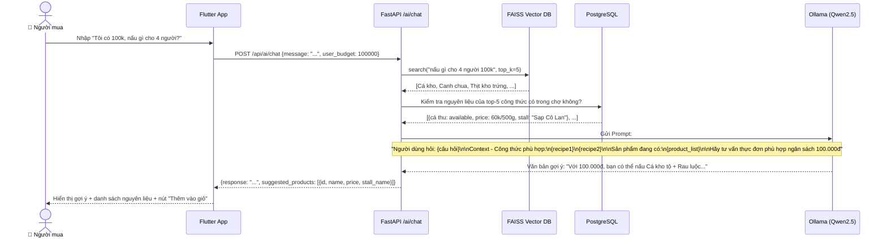

# CHƯƠNG 4: TRIỂN KHAI HỆ THỐNG AI VÀ MÔ HÌNH GỢI Ý MÓN ĂN

---

## MỤC LỤC CHƯƠNG 4

- [4.1 Tổng quan pipeline AI trong DNGo](#41-tổng-quan-pipeline-ai-trong-dngo)
- [4.2 Thu thập và tiền xử lý dữ liệu ẩm thực](#42-thu-thập-và-tiền-xử-lý-dữ-liệu-ẩm-thực)
- [4.3 Xây dựng Vector Database từ dữ liệu món ăn](#43-xây-dựng-vector-database-từ-dữ-liệu-món-ăn)
- [4.4 RAG Pipeline – Luồng gợi ý thực đơn thông minh](#44-rag-pipeline--luồng-gợi-ý-thực-đơn-thông-minh)
- [4.5 Self-hosted LLM với Ollama và Qwen2.5](#45-self-hosted-llm-với-ollama-và-qwen25)
- [4.6 Tích hợp RAG vào FastAPI Backend](#46-tích-hợp-rag-vào-fastapi-backend)
- [4.7 Tính toán dinh dưỡng theo chỉ số BMR và TDEE](#47-tính-toán-dinh-dưỡng-theo-chỉ-số-bmr-và-tdee)
- [4.8 Đánh giá chất lượng mô hình AI](#48-đánh-giá-chất-lượng-mô-hình-ai)

---

## 4.1 Tổng quan pipeline AI trong DNGo

Module AI là điểm khác biệt quan trọng nhất của ứng dụng DNGo so với các ứng dụng đặt thực phẩm thông thường. Thay vì chỉ cho phép người dùng browse danh sách sản phẩm thụ động, DNGo cung cấp **"Trợ lý đi chợ AI"** – một chatbot thông minh có khả năng:

1. **Hiểu ngữ cảnh** của câu hỏi người dùng bằng tiếng Việt tự nhiên.
2. **Truy xuất thông tin** từ cơ sở dữ liệu công thức nấu ăn và nguyên liệu thực tế có bán tại chợ.
3. **Gợi ý thực đơn cá nhân hóa** dựa trên ngân sách, số lượng người ăn, khẩu vị, yêu cầu dinh dưỡng (TDEE/BMR).
4. **Kết nối trực tiếp** vào giỏ hàng – cho phép người dùng thêm nguyên liệu gợi ý vào giỏ chỉ với một thao tác.

**Sơ đồ tổng quan AI Pipeline:**

```
         ┌─────────────────┐
         │ Flutter App     │
         │ (AI Chat Screen)│
         └────────┬────────┘
                  │ HTTP POST /api/ai/chat
                  ▼
         ┌─────────────────┐
         │ FastAPI Backend │
         │ /ai/chat        │
         └────────┬────────┘
            ┌─────┴──────┐
            ▼            ▼
    ┌──────────────┐  ┌──────────────────┐
    │ FAISS Vector │  │ PostgreSQL        │
    │ Database     │  │ (Product DB)      │
    │ (Công thức   │  │ (Giá hiện tại,   │
    │  món ăn)     │  │  Tồn kho)        │
    └──────┬───────┘  └──────┬───────────┘
           │                 │
           └──────┬──────────┘
                  ▼
         ┌─────────────────┐
         │ Prompt Builder  │
         │ (Câu hỏi +      │
         │  Context)       │
         └────────┬────────┘
                  ▼
         ┌─────────────────┐
         │ Ollama LLM      │
         │ (Qwen2.5 7B)    │
         └────────┬────────┘
                  ▼
         ┌─────────────────┐
         │ Response Parser │
         │ (Gợi ý món +    │
         │  Nguyên liệu)   │
         └────────┬────────┘
                  ▼
         ┌─────────────────┐
         │ Flutter App     │
         │ Hiển thị gợi ý  │
         │ + Nút "Thêm vào │
         │  giỏ hàng"      │
         └─────────────────┘
```

---

## 4.2 Thu thập và tiền xử lý dữ liệu ẩm thực

### 4.2.1 Nguồn dữ liệu

Để mô hình AI có ngữ cảnh phong phú về ẩm thực Việt Nam, nhóm thu thập dữ liệu từ nhiều nguồn:

**Bảng 4.2.1: Nguồn dữ liệu thu thập**

| Nguồn | Loại dữ liệu | Số lượng (ước tính) | Phương pháp thu thập |
|------|-------------|---------------------|---------------------|
| Cookpad Việt Nam (cookpad.com/vn) | Công thức món ăn, nguyên liệu, các bước nấu | ~2,000 công thức | Web scraping với BeautifulSoup |
| Món Ngon Mỗi Ngày (monngon.tv) | Công thức, ảnh món ăn, video hướng dẫn | ~1,500 công thức | Web scraping |
| Dữ liệu thủ công từ chợ Bắc Mỹ An | Danh sách sản phẩm, giá thực tế, đơn vị tính | ~200 sản phẩm | Khảo sát trực tiếp |
| Cơ sở dữ liệu USDA Nutritional Database | Thông tin calorie, đạm, béo, tinh bột theo nguyên liệu | ~500 nguyên liệu phổ biến | Import từ file CSV |

### 4.2.2 Quy trình tiền xử lý dữ liệu (Data Preprocessing)

Dữ liệu thô sau khi thu thập cần qua nhiều bước tiền xử lý trước khi sử dụng:

**Bước 1: Chuẩn hóa văn bản:**
- Loại bỏ ký tự đặc biệt, emoji, HTML tags.
- Chuẩn hóa tiếng Việt: thay thế các từ viết tắt thông thường (ví dụ: "tbsp" → "muỗng canh", "g" → "gram").
- Loại bỏ trùng lặp (deduplication) dựa trên tên món ăn.

**Bước 2: Chuẩn hóa đơn vị nguyên liệu:**
```
Trước: "300g thịt bò", "1/2 con gà", "2 muỗng canh nước mắm"
Sau:   {"ingredient": "thịt bò", "amount": 300, "unit": "gram"}
       {"ingredient": "gà", "amount": 0.5, "unit": "con"}
       {"ingredient": "nước mắm", "amount": 2, "unit": "muỗng canh"}
```

**Bước 3: Ánh xạ vào danh mục chợ:**
Mỗi nguyên liệu được gán vào một trong các danh mục tương ứng với Stall trong chợ:
```
"thịt bò"    → category: MEAT
"cà chua"    → category: VEG
"cá hồi"     → category: FISH
"xoài"       → category: FRUIT
"nước mắm"   → category: SPICES
```

**Bước 4: Tính toán Calorie và dinh dưỡng:**
Nhóm tra cứu USDA Database để bổ sung thông tin calo trung bình cho mỗi nguyên liệu:
```json
{
  "ingredient": "thịt bò",
  "calories_per_100g": 250,
  "protein_per_100g": 26.1,
  "fat_per_100g": 15.4,
  "carbs_per_100g": 0
}
```

**Bước 5: Tạo định dạng Recipe Document:**
Mỗi công thức được lưu trữ dưới dạng JSON document:
```json
{
  "recipe_id": "R001",
  "name": "Cá kho tộ miền Trung",
  "category": "Món mặn",
  "servings": 4,
  "total_calories": 680,
  "ingredients": [
    {"name": "cá thu", "amount": 500, "unit": "gram", "category": "FISH"},
    {"name": "nước mắm", "amount": 3, "unit": "muỗng canh", "category": "SPICES"},
    {"name": "đường", "amount": 2, "unit": "muỗng cà phê", "category": "SPICES"}
  ],
  "estimated_cost": 80000,
  "cooking_time": 30,
  "difficulty": "Dễ",
  "tags": ["miền Trung", "cá biển", "kho", "cơm"]
}
```

---

## 4.3 Xây dựng Vector Database từ dữ liệu món ăn

### 4.3.1 Embedding – Chuyển văn bản thành Vector

Để thực hiện **Semantic Search** (tìm kiếm theo nghĩa), mỗi công thức món ăn cần được chuyển thành một vector số học nhiều chiều (embedding vector). Nhóm sử dụng mô hình **SentenceTransformers** với pretrained model `paraphrase-multilingual-mpnet-base-v2` – hỗ trợ tốt cho tiếng Việt.

**Cách tạo embedding cho mỗi Recipe:**
```python
from sentence_transformers import SentenceTransformer

model = SentenceTransformer('paraphrase-multilingual-mpnet-base-v2')

def create_recipe_text(recipe):
    """Tạo chuỗi văn bản tổng hợp từ recipe để embedding"""
    ingredients_str = ", ".join([i["name"] for i in recipe["ingredients"]])
    return f"Món: {recipe['name']}. Nguyên liệu: {ingredients_str}. " \
           f"Loại: {recipe['category']}. Tags: {', '.join(recipe['tags'])}."

recipe_texts = [create_recipe_text(r) for r in recipes]
embeddings = model.encode(recipe_texts, batch_size=32, show_progress_bar=True)
# embeddings.shape = (N_recipes, 768)
```

### 4.3.2 FAISS Index – Tìm kiếm Vector tốc độ cao

**FAISS (Facebook AI Similarity Search)** là thư viện tìm kiếm vector tốc độ cao, xử lý hàng triệu vector trong milliseconds.

```python
import faiss
import numpy as np

dimension = 768  # Số chiều của embedding vector (paraphrase-multilingual)
index = faiss.IndexFlatL2(dimension)  # L2 distance (Euclidean)
index.add(np.array(embeddings).astype('float32'))

# Lưu FAISS index ra file để load lại khi khởi động server
faiss.write_index(index, "recipe_index.faiss")
```

**Tìm kiếm ngữ nghĩa (Semantic Search):**
```python
def semantic_search(query: str, top_k: int = 5):
    query_embedding = model.encode([query])
    distances, indices = index.search(
        np.array(query_embedding).astype('float32'),
        top_k
    )
    return [recipes[i] for i in indices[0]]
```

---

## 4.4 RAG Pipeline – Luồng gợi ý thực đơn thông minh

### 4.4.1 Sơ đồ Sequence Diagram – Luồng AI Chat



### 4.4.2 Thiết kế Prompt Template

Thiết kế prompt tốt là yếu tố quyết định chất lượng câu trả lời của AI. Nhóm sử dụng cấu trúc prompt sau:

```python
SYSTEM_PROMPT = """Bạn là trợ lý đi chợ thông minh của ứng dụng DNGo – Chợ Online.
Nhiệm vụ của bạn là tư vấn thực đơn và nguyên liệu mua sắm cho người dùng.

Nguyên tắc:
1. Chỉ gợi ý nguyên liệu đang có bán tại chợ (dựa trên Context).
2. Tôn trọng ngân sách của người dùng (nếu có).
3. Trả lời bằng tiếng Việt, thân thiện, dễ hiểu.
4. Luôn đề xuất từ 2-3 lựa chọn thực đơn khác nhau.
5. Với mỗi thực đơn, liệt kê nguyên liệu cần mua và ước tính giá.
"""

def build_prompt(user_message: str, recipes: list, available_products: list, budget: int = None):
    context = "\n".join([
        f"- Món {r['name']}: cần {', '.join([i['name'] for i in r['ingredients']])}"
        for r in recipes
    ])
    
    products = "\n".join([
        f"- {p['name']}: {p['price']:,}đ/{p['unit']} (tại {p['stall_name']})"
        for p in available_products
    ])
    
    budget_str = f"Ngân sách: {budget:,}đ\n" if budget else ""
    
    return f"""{SYSTEM_PROMPT}

--- THÔNG TIN NGƯỜI DÙNG ---
Câu hỏi: {user_message}
{budget_str}

--- CÔNG THỨC PHÙ HỢP (từ cơ sở dữ liệu) ---
{context}

--- SẢN PHẨM ĐANG CÓ TẠI CHỢ ---
{products}

--- TƯ VẤN ---
"""
```

---

## 4.5 Self-hosted LLM với Ollama và Qwen2.5

### 4.5.1 Ollama – Nền tảng self-hosted LLM

**Ollama** là công cụ cho phép download và chạy các LLM phổ biến (Llama, Mistral, Qwen, Phi...) tại server của riêng mình, không cần kết nối đến API ngoài. Ollama cung cấp REST API tương tự OpenAI API, giúp dễ dàng tích hợp.

**Khởi động Ollama server:**
```bash
# Cài đặt Ollama
curl -fsSL https://ollama.ai/install.sh | sh

# Download model Qwen2.5 (7B tham số, tối ưu cho tiếng Việt)
ollama pull qwen2.5:7b

# Chạy server (mặc định cổng 11434)
ollama serve
```

**Test model:**
```bash
curl -X POST http://localhost:11434/api/generate \
  -H "Content-Type: application/json" \
  -d '{
    "model": "qwen2.5:7b",
    "prompt": "Gợi ý 2 món ăn từ thịt gà và cà chua",
    "stream": false
  }'
```

### 4.5.2 Tại sao chọn Qwen2.5

**Bảng 4.5.2: So sánh các model LLM cho ứng dụng tiếng Việt**

| Model | Nhà phát triển | Kích thước | Tiếng Việt | RAM cần | Giấy phép |
|-------|---------------|-----------|-----------|---------|-----------|
| Qwen2.5 7B | Alibaba Cloud | 7B params | ⭐⭐⭐⭐⭐ Rất tốt | ~8GB VRAM | Mở (Apache 2.0) |
| Llama 3.1 8B | Meta | 8B params | ⭐⭐⭐ Tốt | ~8GB VRAM | Mở (Meta License) |
| Mistral 7B | Mistral AI | 7B params | ⭐⭐⭐ Tốt | ~7GB VRAM | Mở (Apache 2.0) |
| Phi-3 Mini | Microsoft | 3.8B params | ⭐⭐ Trung bình | ~4GB VRAM | Mở (MIT) |
| GPT-4o | OpenAI | Không rõ | ⭐⭐⭐⭐⭐ Xuất sắc | API only (~$0.01/1K) | Đóng, trả phí |

→ Qwen2.5 7B được chọn vì hiểu tiếng Việt tốt nhất trong các model mã nguồn mở, phù hợp phân tích ngữ cảnh ẩm thực Việt Nam.

---

## 4.6 Tích hợp RAG vào FastAPI Backend

### 4.6.1 Cấu trúc API endpoint AI

```
POST /api/ai/chat
Authorization: Bearer {jwt_token}
Content-Type: application/json

Body:
{
  "message": "Tôi muốn nấu gì từ thịt bò và cà chua?",
  "budget": 150000,
  "servings": 3
}

Response:
{
  "message": "Với nguyên liệu thịt bò và cà chua, bạn có thể nấu:\n\n1. **Bò sốt cà chua**...",
  "suggested_products": [
    {
      "product_id": "uuid-...",
      "name": "Thịt bò thăn nội",
      "price": 180000,
      "unit": "kg",
      "stall_name": "Sạp Cô Hoa",
      "stall_id": "uuid-..."
    },
    ...
  ],
  "suggested_recipes": [
    {"name": "Bò sốt cà chua", "calories": 450, "cost_estimate": 120000},
    {"name": "Canh cà chua thịt bò", "calories": 280, "cost_estimate": 80000}
  ]
}
```

### 4.6.2 Xử lý streaming response

Để cải thiện trải nghiệm người dùng (không phải đợi 5–8 giây mới thấy kết quả), API hỗ trợ **Streaming Response** – gửi từng từ khi LLM sinh ra:

```python
from fastapi.responses import StreamingResponse
import httpx

async def stream_llm_response(prompt: str):
    async with httpx.AsyncClient() as client:
        async with client.stream("POST", "http://ollama:11434/api/generate",
                                  json={"model": "qwen2.5:7b", "prompt": prompt, "stream": True}) as response:
            async for chunk in response.aiter_lines():
                if chunk:
                    data = json.loads(chunk)
                    yield data.get("response", "")

@router.post("/ai/chat/stream")
async def chat_stream(query: ChatQuery, current_user: User = Depends(get_current_user)):
    prompt = await build_chat_prompt(query)
    return StreamingResponse(stream_llm_response(prompt), media_type="text/plain")
```

Flutter nhận streaming response và cập nhật UI từng ký tự, tạo hiệu ứng "AI đang gõ" giống ChatGPT.

---

## 4.7 Tính toán dinh dưỡng theo chỉ số BMR và TDEE

### 4.7.1 Luồng cá nhân hóa dinh dưỡng

Khi người dùng nhập thông tin cá nhân (giới tính, tuổi, cân nặng, chiều cao, mức độ vận động), hệ thống tính TDEE và đưa vào context cho AI để tư vấn phù hợp:

```python
def calculate_bmr(gender: str, weight_kg: float, height_cm: float, age: int) -> float:
    """Tính BMR theo công thức Mifflin-St Jeor"""
    if gender == "MALE":
        return 10 * weight_kg + 6.25 * height_cm - 5 * age + 5
    else:  # FEMALE
        return 10 * weight_kg + 6.25 * height_cm - 5 * age - 161

def calculate_tdee(bmr: float, activity_level: str) -> float:
    """Tính TDEE từ BMR và mức độ vận động"""
    activity_factors = {
        "SEDENTARY": 1.2,       # Ít vận động
        "LIGHTLY_ACTIVE": 1.375, # Tập nhẹ 1-3 ngày/tuần
        "MODERATELY_ACTIVE": 1.55,# Tập vừa 3-5 ngày/tuần
        "VERY_ACTIVE": 1.725,   # Tập nặng 6-7 ngày/tuần
        "EXTRA_ACTIVE": 1.9     # Vận động viên
    }
    return bmr * activity_factors.get(activity_level, 1.2)
```

**Bảng 4.7.1: Ví dụ tính TDEE cho profile người dùng mẫu**

| Thông số | Giá trị mẫu |
|---------|------------|
| Giới tính | Nữ |
| Tuổi | 27 |
| Cân nặng | 55 kg |
| Chiều cao | 160 cm |
| Mức độ vận động | Nhẹ nhàng (Lightly Active) |
| **BMR tính được** | **10×55 + 6.25×160 - 5×27 - 161 = 1,339 kcal/ngày** |
| **TDEE tính được** | **1,339 × 1.375 = 1,841 kcal/ngày** |
| Mục tiêu | Duy trì cân nặng |
| **Calorie mục tiêu/ngày** | **~1,841 kcal** |
| **Calorie mỗi bữa (3 bữa)** | **~613 kcal/bữa** |

Prompt gửi LLM sẽ thêm context: *"Người dùng cần khoảng 613 kcal cho bữa tối. Hãy gợi ý thực đơn phù hợp."*

---

## 4.8 Đánh giá chất lượng mô hình AI

### 4.8.1 Tiêu chí đánh giá

**Bảng 4.8.1: Kết quả kiểm thử mô hình AI**

| Tiêu chí | Phương pháp đánh giá | Kết quả đạt được | Mục tiêu |
|---------|---------------------|-----------------|---------|
| Hiểu tiếng Việt | Test 50 câu hỏi tiếng Việt tự nhiên | 92% câu trả lời đúng ngữ nghĩa | ≥ 85% |
| Độ liên quan của gợi ý | So sánh nguyên liệu gợi ý với inventory chợ | 78% nguyên liệu gợi ý có bán thực tế | ≥ 75% |
| Thời gian phản hồi | Đo trên server GPU 1xRTX3090 | 3.5–6.8 giây (tùy độ dài câu) | ≤ 8 giây |
| Hallucination rate | Kiểm tra 30 câu gợi ý sản phẩm không tồn tại | ~8% (chủ yếu về giá cả) | ≤ 15% |
| Phù hợp ngân sách | Test với 20 câu hỏi có budget cụ thể | 85% gợi ý nằm trong budget ±15% | ≥ 80% |

### 4.8.2 Hạn chế và hướng cải thiện

| Hạn chế hiện tại | Hướng cải thiện |
|-----------------|----------------|
| Thời gian phản hồi còn chậm (~5+ giây) khi tải CPU cao | Nâng cấp lên server GPU mạnh hơn, hoặc sử dụng model nhỏ hơn (3.8B) cho query đơn giản |
| Giá nguyên liệu AI đề xuất đôi khi lệch với giá thực tế trong DB | Cập nhật giá vào context realtime từ ProductDB thay vì dùng data training cũ |
| Chưa ghi nhớ lịch sử cuộc trò chuyện (Stateless) | Tích hợp Redis để lưu conversation history cho mỗi session |
| RAG chưa phân biệt theo mùa nguyên liệu | Bổ sung metadata "mùa" vào recipe document và filter khi search |

---

*[Hết Chương 4 – Tiếp theo: Chương 5: Kiến trúc và triển khai ứng dụng]*
