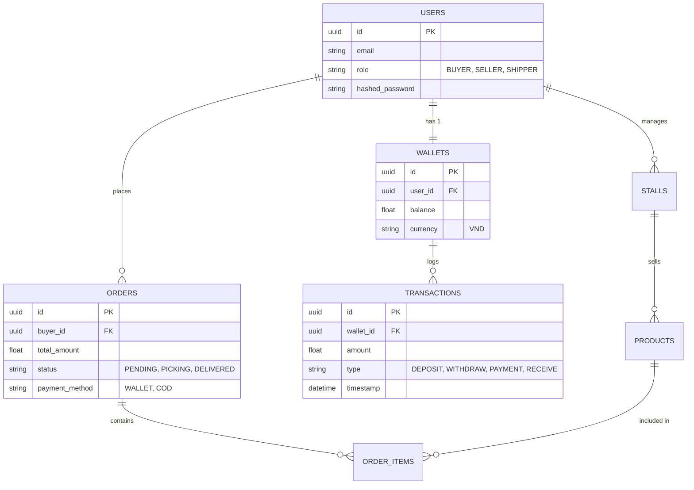

# BÁO CÁO TOÀN VĂN: XÂY DỰNG ỨNG DỤNG THƯƠNG MẠI ĐIỆN TỬ DNGO – CHỢ ONLINE TÍCH HỢP AI

---

## CHƯƠNG 3: PHÂN TÍCH VÀ THIẾT KẾ HỆ THỐNG

### 3.1 Yêu cầu chức năng cải tiến
Dựa trên những tồn tại ở giai đoạn trước, hệ thống đã được thiết kế lại bổ sung hai nghiệp vụ quan trọng nhất là **Shipper nội chợ** và **Ví thanh toán nội bộ**.

#### 3.1.1 Yêu cầu đối với Người Mua (Buyer)
- **Đăng ký / Đăng nhập:** Bằng email/số điện thoại.
- **Tìm kiếm & Gợi ý AI:** Chat với trợ lý ảo để nhận công thức dựa trên số tiền hoặc nguyên liệu đang có.
- **Giỏ hàng ngách (Multi-Stall Cart):** Cho phép người mua chọn nhiều sản phẩm từ nhiều sạp khác nhau trong cùng một chợ vào một lần thanh toán duy nhất.
- **Thanh toán qua Ví:** Người mua có hệ thống ví cá nhân. Có thể nạp tiền thông qua chuyển khoản ngân hàng và sử dụng ví để thanh toán không chạm, tránh phí giao dịch từng lần của cổng ngoài.
- **Theo dõi đơn hàng:** Live-tracking trạng thái giao từ lúc tiểu thương đóng gói đến lúc Shipper nhận hàng.

#### 3.1.2 Yêu cầu đối với Người Bán (Seller)
- **Quản lý gian hàng:** Đăng sản phẩm mới, cập nhật tồn kho, duyệt đơn hàng.
- **Ví tiểu thương (Seller Wallet):** Ngay sau khi Shipper xác nhận giao hàng thành công, tiền từ Ví hệ thống sẽ tự động đối soát và cộng vào Ví của tiểu thương. Tiểu thương có thể rút tiền mặt từ Ví về tài khoản Ngân hàng bất cứ lúc nào.
- **Thống kê doanh thu:** Báo cáo chi tiết số dư, dòng tiền vào/ra theo ngày/tháng.

#### 3.1.3 Yêu cầu đối với Shipper
- **Theo dõi tuyến đường (Route Map):** Hiển thị lộ trình lấy hàng theo sơ đồ chợ và dẫn đường tới nhà khách qua OSRM.
- **Xác nhận giao hàng:** Upload hình ảnh bằng chứng giao hàng thành công.
- **Ví Thu nhập:** Nhận thù lao vận chuyển trực tiếp vào ví hệ thống.

---

### 3.2 Phân tích thiết kế Use Case

#### 3.2.1 Sơ đồ Use Case Tổng Quát
```mermaid
usecaseDiagram
    actor M as Người mua (Buyer)
    actor S as Người bán (Seller)
    actor SH as Shipper
    actor AD as Admin

    M --> (Tìm kiếm món/nguyên liệu)
    M --> (Chat AI tư vấn thực đơn)
    M --> (Đặt mua từ nhiều sạp)
    M --> (Thanh toán qua Ví Nội Bộ)

    S --> (Quản lý mặt hàng và giá)
    S --> (Nhận và đóng gói đơn)
    S --> (Rút tiền từ Ví về Ngân Hàng)

    SH --> (Nhận chuyến giao hàng)
    SH --> (Gom đơn tại các sạp)
    SH --> (Giao hàng cho Buyer)

    AD --> (Duyệt hồ sơ tiểu thương mới)
    AD --> (Đối soát và nạp tiền Ví)
```

### 3.3 Sơ đồ Activity: Quy trình Đặt hàng và Thanh toán bằng Ví

Sơ đồ sau mô tả luồng điều hướng đơn hàng có liên quan tới tính năng xử lý Ví thanh toán, giải quyết triệt để rủi ro dòng tiền thủ công truyền thống:

```mermaid
activityDiagram
    start
    :Khách hàng chốt Giỏ Hàng;
    if (Chọn phương thức thanh toán?) then (Ví Nội Bộ)
        if (Số dư ví đủ?) then (Đủ tiền)
            :Trừ tiền Ví Khách Hàng tạm giữ;
            :Tách đơn gửi thông báo cho các Tiểu Thương;
        else (Không đủ)
            :Yêu cầu nạp thêm tiền;
            stop
        endif
    else (COD)
        :Tạo đơn chờ Thanh toán;
        :Tách đơn gửi thông báo cho các Tiểu Thương;
    endif

    fork
        :Sạp A chuẩn bị hàng;
    fork again
        :Sạp B chuẩn bị hàng;
    end fork

    :Shipper đi gom hàng theo lộ trình OSRM;
    :Giao cho Khách Hàng tới nhà;
    
    if (Thanh toán Ví?) then (Đúng)
        :Mở khóa tiền tạm giữ;
        :Cộng tiền trực tiếp vào Ví các Tiểu Thương tỷ lệ khối lượng;
    else (COD)
        :Shipper thu tiền mặt;
        :Shipper nộp lại tiền mặt hoặc trừ Ví Shipper;
    endif
    stop
```

### 3.4 Thiết kế Cơ Sở Dữ Liệu (ERD)

Kiến trúc CSDL được thiết kế tối giản, tập trung vào mô hình E-commerce có ứng dụng Wallet với 5 bảng lõi:
1. **User (Users):** Quản lý chung người dùng các role.
2. **Wallet:** Được khởi tạo theo cơ chế 1-1 với tài khoản User.
3. **Stalls (Gian hàng):** Quản lý định vị bản đồ và catalogue của tiểu thương.
4. **Orders / OrderItems:** Chứa ID gian hàng riêng biệt.
5. **Transactions:** Bảng sinh ra để theo dõi biến động số dư của ví, kiểm toán tài chính.


Khác biệt: Thiết kế này khắc phục trực tiếp lỗ hổng chưa làm rõ dòng tiền của Cap 2, ràng buộc chặt chẽ tính minh bạch giao dịch. Mọi thao tác mua hàng qua Ví lập tức kích hoạt Record ở bảng `TRANSACTIONS`.
