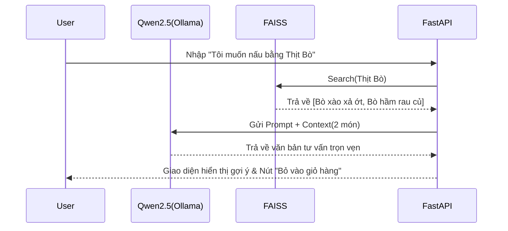

# BÁO CÁO TOÀN VĂN: XÂY DỰNG ỨNG DỤNG THƯƠNG MẠI ĐIỆN TỬ DNGO – CHỢ ONLINE TÍCH HỢP AI

---

## CHƯƠNG 4: TRIỂN KHAI MÔ HÌNH KHUYẾN NGHỊ VÀ AI

### 4.1 Khảo sát và tiền xử lý dữ liệu ẩm thực
Để tạo ra một chatbot hiểu được nhu cầu ẩm thực của người Việt, hệ thống thu thập hơn hàng nghìn công thức nấu ăn từ các trang uy tín (Cookpad, Món Ngon Mỗi Ngày). Dữ liệu được đưa qua bước tiền xử lý (Preprocessing):
- Loại bỏ các ký tự nhiễu, chuẩn hóa các đơn vị đo lường (gram, ml, muỗng, vá).
- Chuyển đổi định dạng thành các khối `JSON` cấu trúc bao gồm: `Tên món`, `Nguyên liệu`, `Cách làm`, và `Giá trị Calorie` quy đổi trung bình.

### 4.2 Kỹ thuật Retrieval-Augmented Generation (RAG)
Thay vì Fine-tune một mô hình (tốn kém tài nguyên và dễ gặp hiện tượng "ảo giác" hallucination khi hỏi thông tin không có trong tập huấn luyện), dự án giải quyết bài toán tư vấn bằng **RAG Pipeline**:
1. **Embedding & Vector DB:** Sử dụng thư viện `SentenceTransformers` dể mã hóa các công thức (Recipes) thành Vector. Kho Vector được lưu trữ bằng `FAISS` hoặc `ChromaDB` ngay trong bộ nhớ cục bộ.
2. **Retrieve (Truy xuất):** Khi người dùng nhập truy vấn "Tôi có 100k, mua được rau muống và thịt gà, gợi ý cho tôi 2 món", hệ thống thực hiện tìm kiếm ngữ nghĩa (Semantic search) trên Vector DB, nhặt ra 3-5 bộ công thức tiềm năng nhất.
3. **Generate (Sinh văn bản):** Prompt được ghép bởi "Câu hỏi người dùng" + "Context từ Vector DB" đưa vào LLM (Ollama - Model Qwen2.5 7B hoặc mBART) để sinh ra câu văn tự nhiên, mượt mà tư vấn cho khách.

### 4.3 Tính toán dinh dưỡng với TDEE và BMR
Hệ thống sử dụng công thức Mifflin-St Jeor để ước tính BMR (Basal Metabolic Rate):
- **Nam:** `BMR = 10 * Trọng_Lượng(kg) + 6.25 * Chiều_Cao(cm) - 5 * Tuổi + 5`
- **Nữ:** `BMR = 10 * Trọng_Lượng(kg) + 6.25 * Chiều_Cao(cm) - 5 * Tuổi - 161`
- Nếu người dùng nhập thông tin cá nhân trên App, FastAPI tự động đối chiếu lượng Calorie từ công thức nấu ăn do RAG truy xuất với chỉ số TDEE/BMR của họ, từ đó tư vấn xem món ăn đó có phù hợp với lộ trình giảm cẩn/tăng cơ không.

---

## CHƯƠNG 5: KIẾN TRÚC VÀ TRIỂN KHAI HỆ THỐNG PHẦN MỀM

### 5.1 Kiến trúc Micro-framework
Hệ thống tuân theo mô hình Client-Server chia tách độc lập để dễ dàng co giãn. 
- **Cổng kết nối:** Giao tiếp qua `RESTful API`.
- **Bảo mật:** Sử dụng JWT (JSON Web Tokens) cho Authentication dọc theo các phiên người dùng, xác thực `Bearer Token` trước mỗi request nhạy cảm (như nạp ví, đặt hàng). 

### 5.2 Xây dựng Backend với FastAPI
- Backend quản lý vòng đời order: từ `Pending -> Approved -> Picking -> Delivered`. Thiết lập Background Task tại FastAPI để khi một đơn hàng thay đổi trạng thái, notification (thông báo) sẽ được đẩy xuống App.
- **Quản lý Rule thời gian:** Áp dụng ràng buộc không nhận đơn mua sau 19h00 (giờ đóng cửa chợ). Backend chặn `HTTP 400 Bad Request` nếu thời gian mua hàng không hợp lệ, giúp đơn giản lý do chậm trễ của tiểu thương.

### 5.3 Lập trình Frontend đa ứng dụng
Mã nguồn phía giao diện được phân tách thành 2 Repository (dự án code) nhưng chia sẻ thiết kế UI giống nhau:
1. `Done-demo` (Buyer/Seller App): Người dùng mua và người bán thao tác trên cùng 1 App nhưng rẽ nhánh Role sau khi đăng nhập.
2. `dngo_shipper_app` (Shipper App): App nội bộ dành cho đối tác giao hàng. Trang bị nút "Hoàn thành vận đơn", cho phép hệ thống lập tức đối soát doanh thu lên Wallet của người bán tương ứng trong DB. Khắc phục triệt để tính bất cập của việc shipper ngoài thu phí COD nhưng không có liên kết trả lại cho các sạp chợ.
